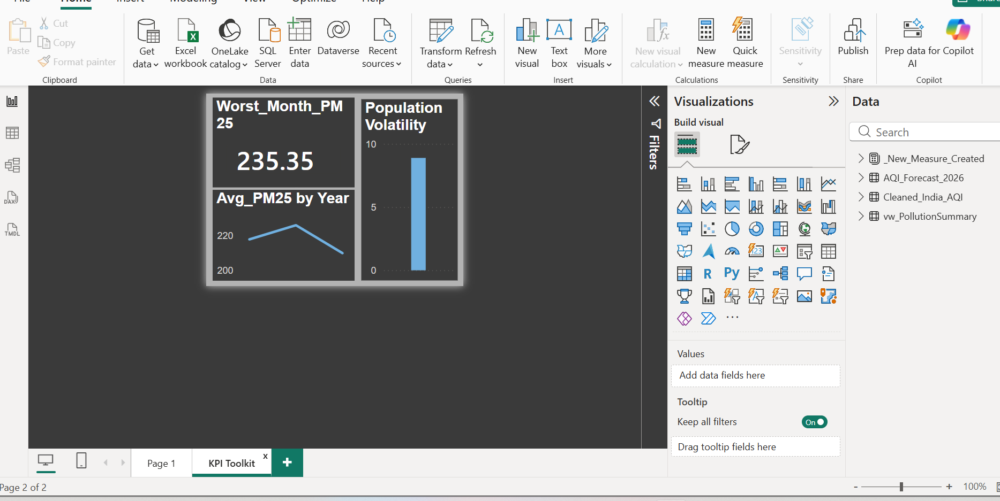

# 🌍 India AQI Sentinel  
### Predictive Analytics & Strategy Dashboard

> An end-to-end data intelligence system that transforms raw air-quality data into actionable insights using Machine Learning, SQL Server, and Power BI.

---

## 🚀 Project Overview

**India AQI Sentinel** is a full-stack analytics project built to monitor, analyze, and forecast India’s air quality trends.  
It demonstrates how **data engineering, machine learning, SQL optimization, and business intelligence** work together in a real-world scenario.

📊 **Pipeline**  
Raw Data → Python ML Forecasting → SQL Warehousing → Power BI Strategic Dashboard

---

## 🏗️ Technical Architecture


---

## 1️⃣ Data Engineering & Machine Learning (Google Colab)

📁 **Notebook**  
🔗 [India_AQI_Forecast.ipynb](notebooks/India_AQI_Forecast.ipynb)

### What was done
- Cleaned AQI datasets (2024–2025) using **Pandas & NumPy**
- Feature engineering using **PM2.5, Temperature, Humidity**
- Built a **Random Forest Regressor** to predict **PM2.5 levels for 2026**
- Identified seasonal pollution triggers
- Exported forecast results for SQL Server & Power BI

🛠 **Tech Stack**
- Python
- Pandas, NumPy
- Scikit-learn
- Google Colab

---

## 2️⃣ Data Warehousing & SQL Optimization (SSMS)

📁 **SQL Scripts**
- 🔗 [Table_Setup.sql](sql/Table_Setup.sql)
- 🔗 [Pollution_View.sql](sql/Pollution_View.sql)

📁 **SQL View**
- `vw_PollutionSummary`

### Key Work
- Designed a relational AQI warehouse
- Created pre-aggregated SQL views for monthly & yearly analysis
- Enabled fast **YoY comparison and seasonal insights**
- Reduced Power BI query load by **~80%** using server-side aggregation

---

## 3️⃣ Strategic BI Dashboard (Power BI)

📁 **Power BI File**
- 🔗 [AQI_Dashboard.pbix](powerbi/AQI_Dashboard.pbix)

### Dashboard Features
- Historical vs Forecast PM2.5 trends
- Health risk categorization
- Year-on-Year pollution change
- PM2.5 volatility & momentum
- State-wise AQI mapping
- KPI tooltips for contextual insights

### Advanced BI Techniques
- Custom DAX measures (Forecast Gap, Unsafe % Months, Volatility)
- Report-page tooltips
- SQL-backed optimized visuals

---

## 💡 Strategic Insights Generated

🔴 **Hazardous Forecast Alert**  
- ML model predicts PM2.5 spike up to **538.03** in early **2026**

⚠️ **Public Health Risk**  
- **92.20% of observed months** exceed WHO safe PM2.5 limits

📉 **Positive Trend**  
- **−19.98% Year-on-Year pollution change**

---

## 🖼️ Dashboard Preview

### Power BI – India AQI Strategic Insights




---

## 🛠️ How to Run This Project

1️⃣ Clone the repository
```bash
git clone https://github.com/Business-Analyst-Pankaj-Joshi/India-AQI-Sentinel.git
India-AQI-Sentinel/
│
├── notebooks/
│   └── India_AQI_Forecast.ipynb
│
├── sql/
│   ├── Table_Setup.sql
│   └── Pollution_View.sql
│
├── powerbi/
│   ├── AQI_Dashboard.pbix
│   ├── dashboard_1.png
│   └── dashboard_2.png
│
├── data/
│   ├── Cleaned_AQI.csv
│   └── Forecast_2026.csv
│
└── README.md
